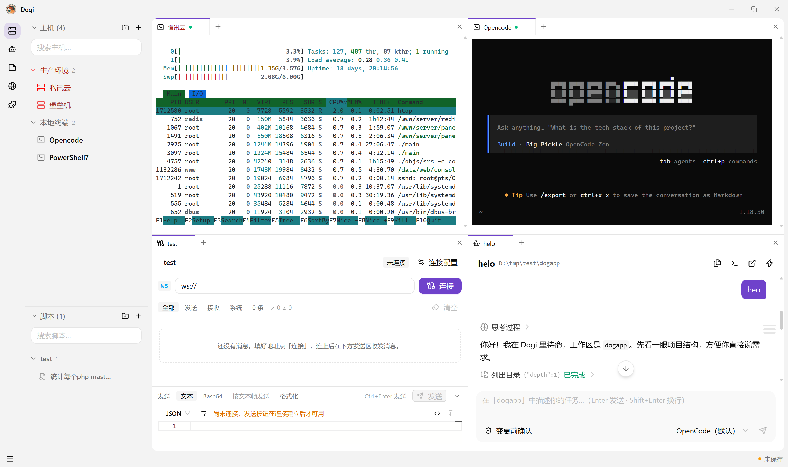

# Dogi — AI 驱动的运维工作台



Electron + React 的桌面研发运维工具：把「连机器 → 干活 → 记下来 → 调接口 → 让 AI 代办」收在一个应用里。
左侧是活动栏功能区，右侧是 VS Code 式的分屏标签组；内置终端 / SSH / SFTP / 服务器监控 / 接口调试 /
笔记 / 脚本 / 插件宿主，以及一个能读写文件、执行命令、调用技能的 AI Agent。

## 功能

### 终端与主机

- **本地终端**：`node-pty`，自动探测 PowerShell / pwsh / CMD / Git Bash / WSL / bash / zsh / fish，可指定默认 shell
- **SSH**：`ssh2`，密码或私钥认证，握手进度实时推送、失败自动重连、keepalive、多会话
- **多标签 + 分屏**：`@xterm/xterm` v6（WebGL 渲染），VS Code 式面板树 —— 向上下左右拆分、拖拽调比例、标签跨组移动
- **zmodem**：终端里直接 `sz` / `rz` 传文件（走系统对话框选文件 / 存文件）
- **服务器监控**：经 SSH 采集 `/proc` + `df`，实时展示 CPU / 内存 / 负载 / 网速 / 磁盘 / uptime，间隔可配
- **SFTP 文件管理**：浏览、上传、下载（含目录递归）、远端复制 / 移动、重命名 / 删除 / 新建目录；
  传输进度汇总到状态栏的传输托盘，可随时取消
- 会话输出环形缓冲（256KB / 会话），供 AI 与调试读取
- 终端配色方案（跟随主题 / 深色 / 浅色 / Solarized Dark / Dracula / Nord）、字号缩放、选中即复制、右键粘贴、命令预测

### AI

两条产品线共用同一套流式事件与渲染组件：

| | 终端 AI 助手 | 工作区 Agent |
| --- | --- | --- |
| 位置 | 终端页底部内嵌卡片 | 独立功能区的会话页 |
| 上下文 | 当前终端会话 | 绑定的本地工作区目录 |
| 工具 | 执行命令 / 发送按键 / 读取终端输出 / 列出终端 | 列目录 / 查找 / 搜索 / 读写编辑删除文件 / 执行命令 / 读取技能 |

- **模型**：基于 **Vercel AI SDK v7**，支持 OpenAI / Anthropic / DeepSeek / Google / 任意 OpenAI 兼容接口（Ollama、vLLM、中转网关）；一个配置可挂多个模型，**模型与后端按会话独立**，设置页那颗星只是「新会话的默认」
- **后端可换**：内置 `ai-sdk`，或连接外部 **ACP agent**（如 codex-acp），应用作为 ACP 客户端
- **权限模式**：`full`（直接执行）/ `confirm`（执行命令前弹确认卡），对话输入框处可实时切换
- **AI 主动追问**：`ask_followup_question` 工具让模型在回合中途弹出结构化选择题，答完**同一回合继续**
- **MCP**：接入任意 stdio MCP server（官方 `@modelcontextprotocol/sdk`），工具自动合并给 AI
- **技能（Skills）**：按 Anthropic Agent Skills 的文件约定自行实现 —— 自动发现
  `<工作区>/.dogi/skills`、`~/.dogi/skills`、跨智能体共享的 `~/.agents/skills`、`~/.claude/skills` 与自定义目录，
  系统提示词只放名称 + 描述，正文交给 `read_skill` 工具按需读取
- **思考过程**：推理模型的 reasoning 内容实时渲染（含第三方网关字段归一化）
- 自定义系统提示词、历史条数上限、完成通知（仅当应用不在前台时）

### 笔记与脚本

- **笔记**：Monaco 编辑器，语言可选，分组 / 拖拽排序 / 搜索
- **脚本**：作为「主机」侧边栏的分区管理；命令面板里可直接在当前终端运行，没有终端时选主机连上去执行

### 接口调试

- **HTTP**：方法 / 请求头（保留空行）/ body、超时、代理、跳过 TLS 校验、手动取消、cURL 导入、请求历史、响应耗时与体积
- **WebSocket**：长连接、附加握手头、子协议、`wss` 自签证书、文本 / 二进制帧（base64 展示），多标签各自独立连接
- 一个请求 = 一个标签，与终端同款的多标签 / 分屏

### 应用外壳

- **命令面板**（`Ctrl+Shift+P`）：命令 / 脚本 / 主机 / 插件的统一入口，插件可注册命令
- **应用内快捷键**可自定义并做冲突检测（新建终端 `Ctrl+Alt+T`、打开设置 `Ctrl+Alt+S`、开关 Agent 内嵌终端等）
- **主题**：明暗 + 强调色方案 + 终端独立配色；**首帧不闪**（preload 在页面脚本前同步取偏好并应用）
- 自定义标题栏、状态栏（保存状态 / 监控条 / AI 开关 / 传输托盘 / 全局菜单）、关闭标签二次确认
- 系统托盘常驻、单实例锁、最小化到托盘
- **数据导入 / 导出**：主机 / 笔记 / 接口请求打包成 zip（自实现 zip，凭据不导出）

### 插件

- 插件 = 一个目录 + `plugin.json`（`main.js` 主进程 + `renderer.js` 渲染端）
- 渲染端走 **blob import**：宿主读源码 → 动态 `import` → `activate(api)` 注册视图；
  宿主注入 `api.antd` / `api.icons` / `api.MonacoEditor` / `api.cn` / `api.react`，插件不自带依赖
- 主进程侧可 `registerHandler` 暴露自有通道，权限（storage / http）在 manifest 里声明
- 示例插件：`plugins/redis-client/`

### 安全

- SSH 密码 / 私钥 / 口令用 Electron `safeStorage`（Windows DPAPI）加密，**只在主进程解密**，渲染端永远拿不到
- 渲染进程与主进程隔离（`contextIsolation` + preload 白名单 IPC），严格 CSP（`script-src 'self' blob:`）
- Agent 的所有文件操作都经 `resolveInside` 做工作区越界检查；媒体预览走受限的自定义协议 `dogi-ws://`
- 密钥类字段在列表接口中脱敏（`hasPassword` / `hasPrivateKey` 等标记）

## 架构

```
src/
  shared/                  # 三端共享的纯类型与纯逻辑（不引 electron、不引 DOM）
    types.ts shortcuts.ts theme.ts workspace-config.ts workspace-media.ts sftp-path.ts plugin.ts ask-followup.ts
  main/
    index.ts               # 窗口 / 托盘 / 菜单 / 单实例锁 / 生命周期
    ipc/                   # 一个通道前缀一个文件，index.ts 统一注册
    services/
      storage.ts           # electron-store 持久化 + safeStorage 加密
      terminal/            # sessions（node-pty + ssh2 统一抽象）shells monitor
      ai/                  # ai（终端助手）agent（工作区）acp-agent acp-detect mcp skills
                           # resolve-model ask-followup workspace-config workspace-fs workspace-media
                           # agent-core/  工具集 / 系统提示词 / 事件适配 / 路径与忽略规则
      api/                 # http ws
      sftp/ transfer/      # sftp；transfer（zip + 导入导出编排）
      plugins/host.ts      # 插件宿主（主进程侧）
      system/              # icon notify opener
  preload/index.ts         # contextBridge 白名单 + 首帧主题
  renderer/
    index.html             # CSP
    src/
      app/                 # 应用装配：App / activities（功能区注册表）/ layout（外壳）
      features/<功能>/      # 每个功能区的 UI 与专属纯函数
      shared/              # components（复用组件）+ lib（复用纯函数）
      stores/app-store.ts  # 全局 zustand store
```

构建不依赖 electron-vite，使用三个独立 Vite 配置自建编排：

| 目标 | 配置 | 输出 |
| --- | --- | --- |
| main（ESM） | `vite.main.mts` | `out/main/index.js` |
| preload（CJS，沙箱兼容） | `vite.preload.mts` | `out/preload/index.cjs` |
| renderer | `vite.config.ts` | `out/renderer/` |

dev 编排在 `scripts/dev.mjs`（Vite dev server + main/preload watch + 重建后自动重启 Electron）。

## 开发

```bash
npm install          # 安装依赖
npm run dev          # 开发模式（Vite dev server + main/preload watch + Electron 自动重启）
npm run build        # 类型检查 + 全量构建（out/）
npm run start        # 运行已构建产物
npm run typecheck    # 仅类型检查（node + web）
npm run dist:win     # 打包（另有 dist / dist:mac / dist:linux / pack）
```

> 注意：项目使用 npm 12 的 install-scripts 安全策略，首次安装后如提示脚本被阻止：
> `npm install-scripts approve electron esbuild node-pty ssh2`，再 `npm rebuild electron node-pty esbuild`

**改动前请读 [AGENTS.md](./AGENTS.md)** —— 里面是项目的架构约定、关键机制与全部实测踩坑记录
（node-pty / antd 6 / AI SDK v7 的版本差异、主题首帧、工作区协议、插件加载、CDP 验证方法等）。

## AI 模型配置示例

设置 → AI 配置 → 模型配置 → 新建：

| 服务商 | Base URL | 模型示例 | 说明 |
| --- | --- | --- | --- |
| OpenAI | 留空 | `gpt-4o` / `gpt-5.1` | 走 Responses API |
| Anthropic | 留空 | `claude-sonnet-4-5` | |
| DeepSeek | 留空 | `deepseek-chat` | |
| Google | 留空 | `gemini-2.5-pro` | |
| OpenAI 兼容 | `http://localhost:11434/v1`（Ollama） | 服务端模型 ID | 默认 chat-completions，思考字段自动归一化 |

# 写在最后

感谢[linux.do](linux.do)论坛支持。